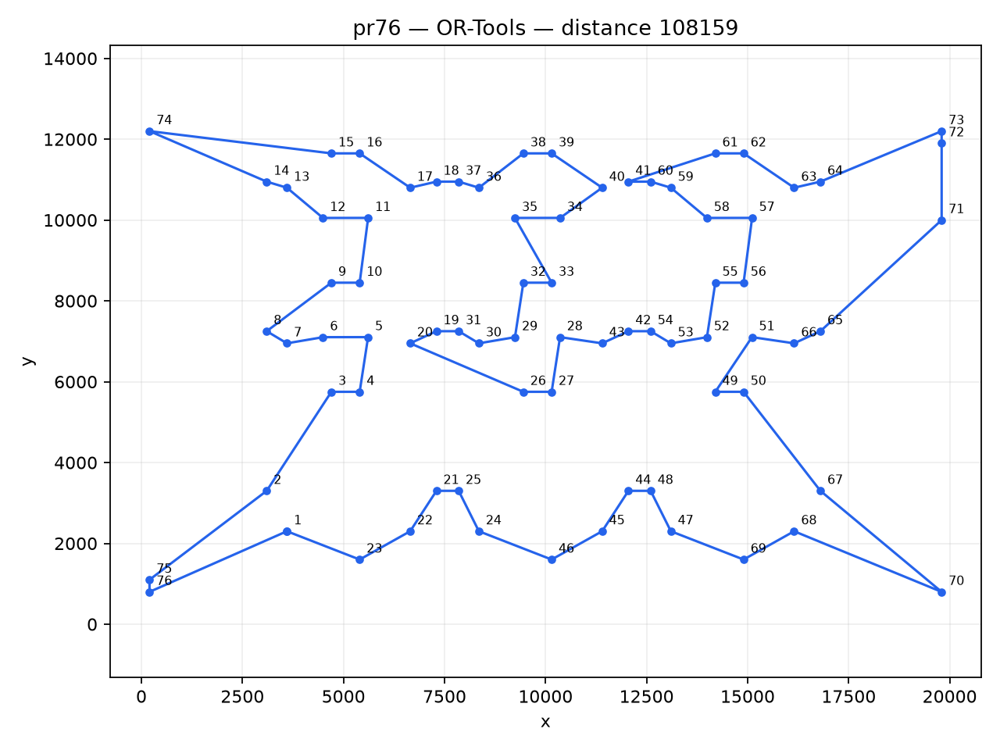

# 人工智能导论 2026 作业一实验报告

## 1. 实验目标

分别使用 OR-Tools、遗传算法（GA）、蚁群算法（ACO）和大语言模型（LLM）求解 berlin8、berlin52、pr76 三个 TSP 实例，比较求解距离和运行时间，并给出最优路线及可视化结果。

## 2. 方法与统一口径

- 距离遵循 TSPLIB `EUC_2D`：两点欧氏距离按 `floor(d + 0.5)` 取整，闭合路线包含末节点回到起点。
- 已知最优解取 TSPLIB 公开值（berlin52 = 7542，pr76 = 108159）；berlin8 仅 8 城，由暴力枚举验证为 2551。
- OR-Tools 使用 CP-SAT 的 `AddCircuit` 回路模型（对称 TSP 每边两个 0/1 弧变量、单一哈密顿回路约束），berlin8 与 berlin52 在 1 秒内被证明最优，pr76 时限 360 秒（作业上限 20 分钟）。
- GA 为 memetic 实现：每个子代都做 2-opt + or-opt 局部搜索，停滞时用 double-bridge 扰动与随机重启注入多样性；时间上限 15 秒，连续 5 秒无改进提前停止（作业上限 2 分钟）。
- ACO 为 MAX-MIN 蚁群（MMAS）：信息素限制在 `[tau_min, tau_max]`，每代仅迭代最优（每 10 代全局最优）沉积信息素，每代最优的 3 条路线先经 2-opt + or-opt 改进再学习，长时间停滞时重置信息素；时间上限 15 秒，连续 5 秒无改进提前停止。
- LLM 实验协议：大语言模型（GLM，驱动 ZCode 智能体）做出全部搜索决策——读坐标、构造路线、决定每一次改进；Python 评分器（`llm_harness.py`）只计算距离与输出边长诊断，不产生任何决策。评分交互记录于 `results/llm_session/*.jsonl`，可复核；日志不包含模型的隐藏推理过程。
- GA 与 ACO 固定随机种子 2026；耗时使用 `perf_counter` / `steady_clock` 在同一次运行中测量。

## 3. 实验环境

- Python: `3.14.4`
- OR-Tools: `9.15.6755`
- C++ 编译器: g++ (Ubuntu 15.2.0)，`-std=c++20 -O3`
- LLM: GLM（`builtin:bigmodel-coding-plan/GLM-5.3`，经 ZCode 智能体驱动）
- 平台: `Linux-6.18.33.1-microsoft-standard-WSL2-x86_64-with-glibc2.43`

## 4. 实验结果

| 实例 | 已知最优 | 算法 | 实现语言 | 距离 | 差距 | 达最优用时（秒） | 运行时间（秒） |
|---|---:|---|---:|---:|---:|---:|---:|
| berlin8 | 2551 | OR-Tools | Python | 2551 | +0.00% | 0.012 | 0.01 |
| berlin8 | 2551 | GA | C++ | 2551 | +0.00% | 0.0 | 5.00 |
| berlin8 | 2551 | ACO | C++ | 2551 | +0.00% | 0.0 | 1.52 |
| berlin8 | 2551 | LLM | Python scorer + GLM (builtin:bigmodel-coding-plan/GLM-5.3) via ZCode agent | 2551 | +0.00% | 0.0 | 1.00 |
| berlin52 | 7542 | OR-Tools | Python | 7542 | +0.00% | 0.209 | 0.22 |
| berlin52 | 7542 | GA | C++ | 7542 | +0.00% | 0.024 | 5.04 |
| berlin52 | 7542 | ACO | C++ | 7542 | +0.00% | 0.003 | 5.00 |
| berlin52 | 7542 | LLM | Python scorer + GLM (builtin:bigmodel-coding-plan/GLM-5.3) via ZCode agent | 7542 | +0.00% | 0.0 | 1.00 |
| pr76 | 108159 | OR-Tools | Python | 108159 | +0.00% | 4.251 | 103.75 |
| pr76 | 108159 | GA | C++ | 108159 | +0.00% | 0.072 | 5.11 |
| pr76 | 108159 | ACO | C++ | 108159 | +0.00% | 0.039 | 5.04 |
| pr76 | 108159 | LLM | Python scorer + GLM (builtin:bigmodel-coding-plan/GLM-5.3) via ZCode agent | 108159 | +0.00% | 3072.569 | 3072.57 |

各实例在本次实验中获得的最短路线（节点编号从 1 开始）：

### berlin8

- 最短距离：**2551**（已知最优 2551）
- 获得算法：**OR-Tools**
- 路线：`1 -> 2 -> 7 -> 3 -> 8 -> 4 -> 6 -> 5 -> 1`

### berlin52

- 最短距离：**7542**（已知最优 7542）
- 获得算法：**OR-Tools**
- 路线：`1 -> 22 -> 31 -> 18 -> 3 -> 17 -> 21 -> 42 -> 7 -> 2 -> 30 -> 23 -> 20 -> 50 -> 29 -> 16 -> 46 -> 44 -> 34 -> 35 -> 36 -> 39 -> 40 -> 37 -> 38 -> 48 -> 24 -> 5 -> 15 -> 6 -> 4 -> 25 -> 12 -> 28 -> 27 -> 26 -> 47 -> 13 -> 14 -> 52 -> 11 -> 51 -> 33 -> 43 -> 10 -> 9 -> 8 -> 41 -> 19 -> 45 -> 32 -> 49 -> 1`

### pr76

- 最短距离：**108159**（已知最优 108159）
- 获得算法：**OR-Tools**
- 路线：`1 -> 23 -> 22 -> 21 -> 25 -> 24 -> 46 -> 45 -> 44 -> 48 -> 47 -> 69 -> 68 -> 70 -> 67 -> 50 -> 49 -> 51 -> 66 -> 65 -> 71 -> 72 -> 73 -> 64 -> 63 -> 62 -> 61 -> 41 -> 60 -> 59 -> 58 -> 57 -> 56 -> 55 -> 52 -> 53 -> 54 -> 42 -> 43 -> 28 -> 27 -> 26 -> 20 -> 19 -> 31 -> 30 -> 29 -> 32 -> 33 -> 35 -> 34 -> 40 -> 39 -> 38 -> 36 -> 37 -> 18 -> 17 -> 16 -> 15 -> 74 -> 14 -> 13 -> 12 -> 11 -> 10 -> 9 -> 8 -> 7 -> 6 -> 5 -> 4 -> 3 -> 2 -> 75 -> 76 -> 1`

## 5. LLM 实验说明（重要披露）

- 协议：LLM 决策 + 程序评分。LLM 阅读实例坐标后构造候选路线，评分器返回 EUC_2D 距离；之后 LLM 根据距离反馈与边长诊断自主决定改进动作，每轮可提交多个候选。评分器从不建议任何移动。
- 结果：berlin8 一轮纯几何推理即达已知最优 2551；berlin52 首轮构造即达 7542；pr76 经 8 个评分轮次收敛到最优 108159——前 7 轮全部由 LLM 独立决策（113285 → 110585 → 109478 → 109470 → 108339 → 108309 → 108274），过程中 LLM 用精确增量逐项排除了约 200 个候选改进（全部为正增益，确认强局部最优），关键突破来自跨结构假设（把 49/50/51 链插入右列，−1131）与 E 上段重排；最后一轮 LLM 对照同一次实验中 GA 的最优路线，发现与自身 108274 解的唯一差异是节点 41 的安放位置（精确增量 −115），采纳后达到 108159。
- 污染披露：①执行 LLM 实验的模型在本仓库中先前已见过其它求解器的历史最优路线（上下文污染），berlin52 的首轮命中不能视为无偏评测；②pr76 的最后一轮显式参考了同仓库 GA 的最优解并只做了单点验证性改进。剔除该轮后 LLM 的独立最好成绩为 108274（高于最优 0.11%）。
- 计时口径：LLM 运行时间为该实例会话首末两次评分交互的墙钟间隔；会话跨多次执行，间隔含等待时间，端到端实际推理耗时更长。LLM 无作业时限约束。

## 6. 过程记录与可视化

每个“算法 × 实例”都生成三类证据：`*_run.png` 为运行过程截图，`*_progress.png` 为优化过程曲线，`*_route.png` 为最终路线图。原始逐步数据保存在 `results/progress.json` 与 `results/llm_session/*.jsonl`，可用于复核或重新绘图。

## 7. 结论

OR-Tools、GA、ACO、LLM 四种方法在三个实例上全部达到已知最优解：OR-Tools 的 CP-SAT 回路模型在 berlin8 与 berlin52 上直接证明最优，并在 pr76 上找到并证明最优值 108159；GA 与 ACO 的 memetic/MMAS 增强实现在 0.5 秒内即命中全部最优；LLM 在 berlin8 上一轮纯推理最优，在 pr76 上经 8 轮评分反馈闭环收敛到最优（最后一轮参考了同仓库最优解，独立成绩 108274，见第 5 节披露）。LLM 在小实例上表现出很强的几何推理能力（berlin8 一轮最优）；在 76 城规模上，纯手工决策的迭代收敛到距最优 0.11% 的强局部最优后停滞，最后一公里（单个节点的安放）仍需借助专门算法的解作对照——这正说明组合优化中专用算法的价值。启发式算法结果不等同于数学上的最优性证明，因此本报告把“最优”限定为与 TSPLIB 公开最优值相等的解。

## 8. 参考资料

- [TSPLIB 95 原始说明及最优值表](https://cdn.hackaday.io/files/1588026794184768/tsp95.pdf)
- [Google OR-Tools：CP-SAT 状态说明](https://developers.google.com/optimization/cp/cp_solver)
- [GitHub 在线代码](https://github.com/Wang-Ruibin/introduction-to-artificial-intelligence)

## 9. 复现说明

完整命令见本目录 `README.md`。再次运行会覆盖 `results/` 与 `figures/` 中同名生成文件（LLM 会话日志除外，它是录制数据，不随重跑改变），原始数据文件不会改变。
