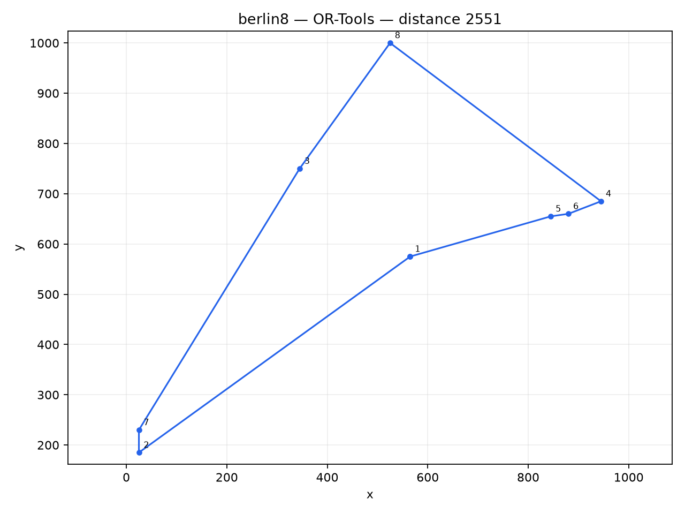
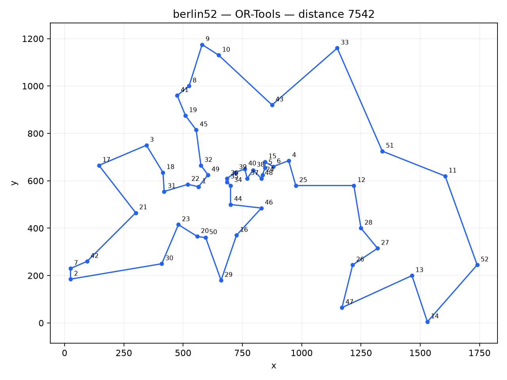
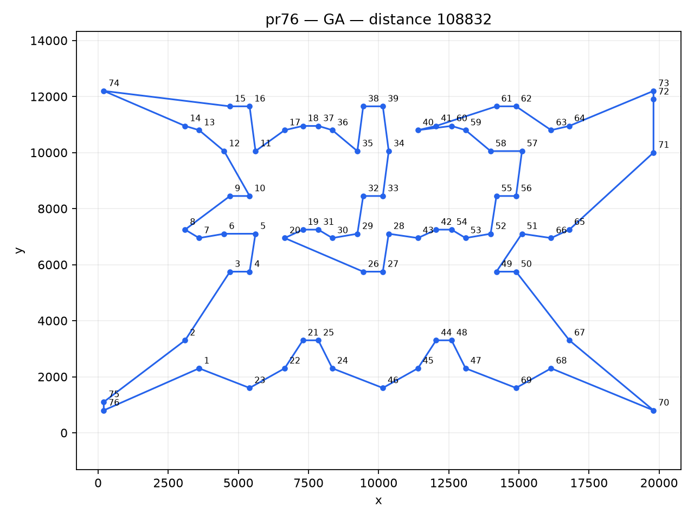

# 人工智能导论 2026 作业一实验报告

## 1. 实验目标

分别使用 OR-Tools、遗传算法（GA）和蚁群算法（ACO）求解 berlin8、berlin52、pr76 三个 TSP 实例，比较求解距离和运行时间，并给出最优路线及可视化结果。

## 2. 方法与统一口径

- 距离遵循 TSPLIB `EUC_2D`：两点欧氏距离按 `floor(d + 0.5)` 取整，闭合路线包含末节点回到起点。
- OR-Tools 使用 `PATH_CHEAPEST_ARC` 初始解和 `GUIDED_LOCAL_SEARCH`，每例上限 20 秒。
- GA 使用顺序交叉、锦标赛选择、区间反转变异、精英保留和 2-opt 局部改进。
- ACO 使用信息素挥发、启发函数、精英信息素强化，并以 2-opt 改进最终路线。
- GA 与 ACO 固定随机种子 2026；耗时使用 `perf_counter` 在同一次运行中测量。

## 3. 实验环境

- Python: `3.14.4`
- OR-Tools: `9.15.6755`
- 平台: `Linux-6.18.33.1-microsoft-standard-WSL2-x86_64-with-glibc2.43`

## 4. 实验结果

| 实例 | 算法 | 实现语言 | 距离 | 运行时间（秒） |
|---|---:|---:|---:|---:|
| berlin8 | OR-Tools | Python | 2551 | 20.009340 |
| berlin8 | GA | C++ | 2551 | 0.012450 |
| berlin8 | ACO | C++ | 2551 | 0.010483 |
| berlin52 | OR-Tools | Python | 7542 | 20.002115 |
| berlin52 | GA | C++ | 7658 | 0.043101 |
| berlin52 | ACO | C++ | 7715 | 0.427130 |
| pr76 | OR-Tools | Python | 109043 | 20.002054 |
| pr76 | GA | C++ | 108832 | 0.067773 |
| pr76 | ACO | C++ | 110985 | 1.174789 |

各实例在本次实验中获得的最短路线（节点编号从 1 开始）：

### berlin8

- 最短距离：**2551**
- 获得算法：**OR-Tools**
- 路线：`1 -> 2 -> 7 -> 3 -> 8 -> 4 -> 6 -> 5 -> 1`

### berlin52

- 最短距离：**7542**
- 获得算法：**OR-Tools**
- 路线：`1 -> 22 -> 31 -> 18 -> 3 -> 17 -> 21 -> 42 -> 7 -> 2 -> 30 -> 23 -> 20 -> 50 -> 29 -> 16 -> 46 -> 44 -> 34 -> 35 -> 36 -> 39 -> 40 -> 37 -> 38 -> 48 -> 24 -> 5 -> 15 -> 6 -> 4 -> 25 -> 12 -> 28 -> 27 -> 26 -> 47 -> 13 -> 14 -> 52 -> 11 -> 51 -> 33 -> 43 -> 10 -> 9 -> 8 -> 41 -> 19 -> 45 -> 32 -> 49 -> 1`

### pr76

- 最短距离：**108832**
- 获得算法：**GA**
- 路线：`1 -> 23 -> 22 -> 21 -> 25 -> 24 -> 46 -> 45 -> 44 -> 48 -> 47 -> 69 -> 68 -> 70 -> 67 -> 50 -> 49 -> 51 -> 66 -> 65 -> 71 -> 72 -> 73 -> 64 -> 63 -> 62 -> 61 -> 41 -> 40 -> 60 -> 59 -> 58 -> 57 -> 56 -> 55 -> 52 -> 53 -> 54 -> 42 -> 43 -> 28 -> 27 -> 26 -> 20 -> 19 -> 31 -> 30 -> 29 -> 32 -> 33 -> 34 -> 39 -> 38 -> 35 -> 36 -> 37 -> 18 -> 17 -> 11 -> 16 -> 15 -> 74 -> 14 -> 13 -> 12 -> 10 -> 9 -> 8 -> 7 -> 6 -> 5 -> 4 -> 3 -> 2 -> 75 -> 76 -> 1`

## 5. 过程记录与可视化

每个“算法 × 实例”都生成三类证据：`*_run.png` 为运行过程截图，`*_progress.png` 为优化过程曲线，`*_route.png` 为最终路线图。原始逐步数据保存在 `results/progress.json`，可用于复核或重新绘图。

## 6. 结论

OR-Tools 的引导式局部搜索在固定时限内提供稳定的高质量基线；GA 和 ACO 能清楚展示群体智能算法逐步收敛的过程。启发式算法结果不等同于数学上的最优性证明，因此本报告把“最优”限定为本次三种算法运行结果中的最短路线。

## 7. 复现说明

完整命令见本目录 `README.md`。再次运行会覆盖 `results/` 与 `figures/` 中同名生成文件，原始数据文件不会改变。
